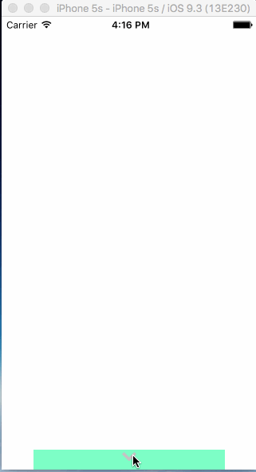

# Project - *FaceCanvas*

**FaceCanvas** is a mini app which let you playing smile icons.
This app also demonstrates how to use animation, gestures in iOS

Time spent: **??** hours spent in total

## User Stories

The following **required** functionality is completed:

- [x] Make the tray draggable
- [x] Animate tray go to up/down position
- [x] Drag face icons to create new same face 

The following **optional** features are implemented:

- [x] Panning Faces
- [x] Scaling Faces
- [x] Rotating Faces
- [x] Set Tray Arrow up/down depends on moving direction.
- [x] Panning Faces
- [x] Dropping newly created face on tray will moving back to original position
- [x] Deleting Faces on double tap
- [x] Frictionful Tray

The following **additional** features are implemented:

- [ ] List anything else that you can get done to improve the app functionality!

## Video Walkthrough

Here's a walkthrough of implemented user stories:

GIF created with [LiceCap](http://www.cockos.com/licecap/).

## Notes

Describe any challenges encountered while building the app.

## License

    Copyright [2016] [Dang Quoc Huy]

    Licensed under the Apache License, Version 2.0 (the "License");
    you may not use this file except in compliance with the License.
    You may obtain a copy of the License at

        http://www.apache.org/licenses/LICENSE-2.0

    Unless required by applicable law or agreed to in writing, software
    distributed under the License is distributed on an "AS IS" BASIS,
    WITHOUT WARRANTIES OR CONDITIONS OF ANY KIND, either express or implied.
    See the License for the specific language governing permissions and
    limitations under the License.
